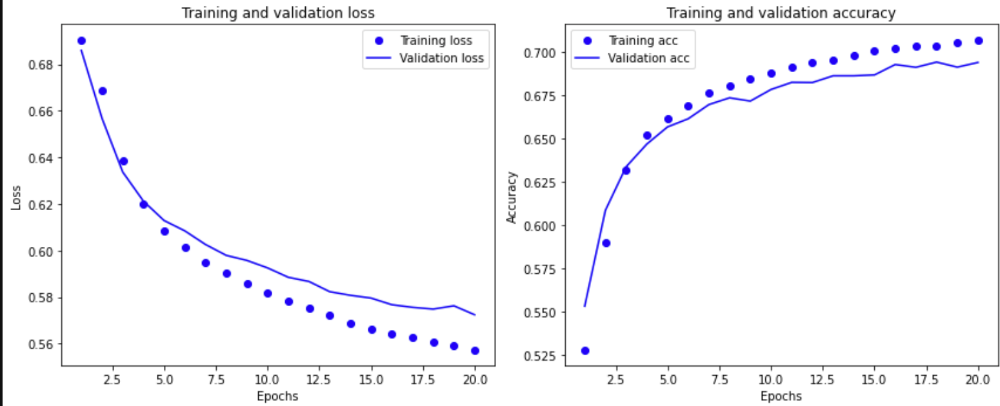
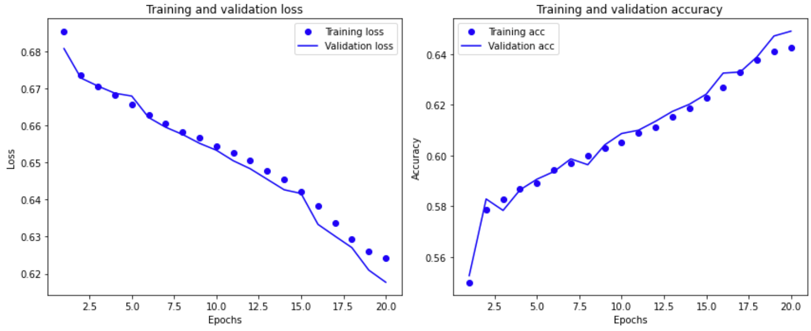
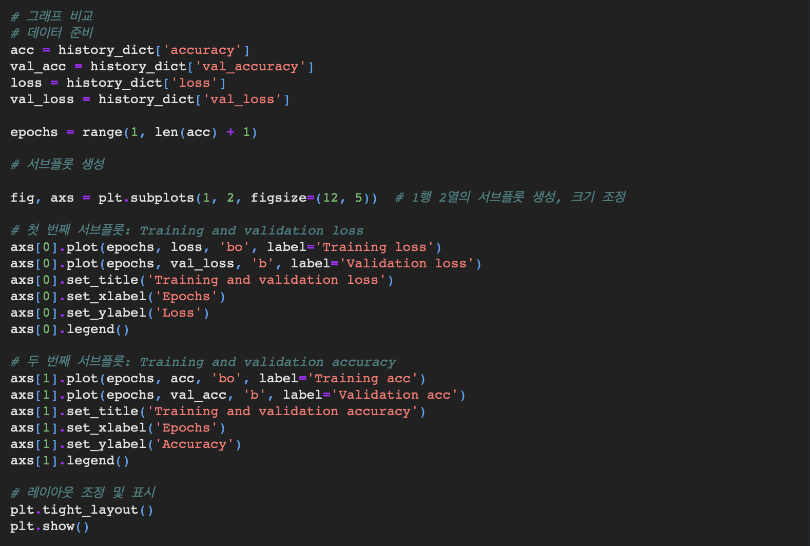
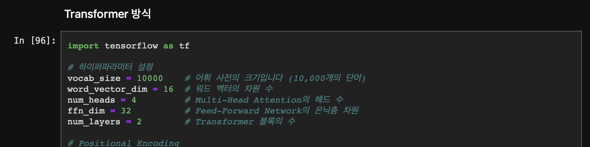
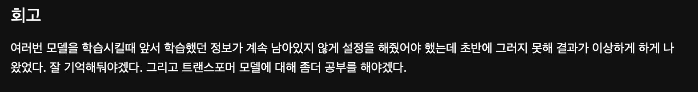

# AIFFEL Campus Online Code Peer Review Templete
- 코더 : 김하영
- 리뷰어 : 김희찬


# PRT(Peer Review Template)
- [X]  **1. 주어진 문제를 해결하는 완성된 코드가 제출되었나요?** 

    다양한 방법으로 Text Classification 태스크를 성공적으로 구현하였습니다.    
        
        
         

    gensim을 활용하여 자체학습된 혹은 사전학습된 임베딩 레이어를 분석하였습니다.    
    

</br>
</br>

- [X]  **2. 전체 코드에서 가장 핵심적이거나 가장 복잡하고 이해하기 어려운 부분에 작성된 
주석 또는 doc string을 보고 해당 코드가 잘 이해되었나요?**   
    
    코드 부분에 주석을 달아 이해하기 쉽도록 작성하였습니다.     
    

</br>
</br>


- [X]  **3. 에러가 난 부분을 디버깅하여 문제를 해결한 기록을 남겼거나
새로운 시도 또는 추가 실험을 수행해봤나요?**
    
    트랜스포머 모델을 시도하였습니다.    
    

</br>
</br>

        
- [X]  **4. 회고를 잘 작성했나요?**    
    
    회고를 잘 작성하셨습니다.
    
</br>
</br>

        
- [X]  **5. 코드가 간결하고 효율적인가요?**      
    주석과 함께 잘 작성하셨습니다.
    

</br>
</br>

# 회고(참고 링크 및 코드 개선)
```
학습때 배운 트랜스 포머 모델을 활용하여 코드를 작성하신 것이 인상적이었습니다.
저같은 경우 학습 노드에 나온 모델만 활용했는데 배운 내용을 최대한 활용해야겠다는 생각이 들었던 코드였습니다.
```
